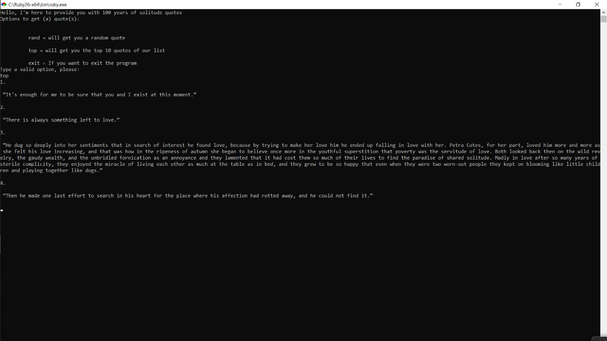

# Rspec enumerable Testing
<!-- TABLE OF CONTENTS -->
## Table of Contents

* [About the Project](#about-the-project)
* [Game Rules](#Program-Options)
* [Pre-requisites](#Pre-requisites)
* [Installation](#Installing-the-program)
* [Built With](#built-with)
* [License](#license)
* [Authors](#Authors)
* [Contributing](#Contributing)
* [License](#License)

<!-- ABOUT THE PROJECT -->
## About The Project

This program provides you with quotes from the 100 years of solitude book.

 
## Program options
 - After the welcome message is displayed you can type: 
 - "rand" will get you a random quote
 - "top" will get you the top ten quotes 
 - "exit" will close the program (or ctrl + c / ⌘ + c)

## Pre-requisites
- Make sure you have [ruby](https://rubyinstaller.org) installed 
on your computer
- gem install bundler =>gem file to manage ruby gems
- A terminal bash for linux or cmd for windows

 ## Installing the program
- On the search function of your computer type "cmd" to open a terminal
- On the terminal run the following commands: 
-   "bundle install" for easy management of gems files
- Git clone(download) the project by running "git clone https://github.com/Psiale/100-years-of-quotes"
- cd into the project folder
- Run bundle install
- cd into bin "cd bin"
- make the main file executable on [linux](https://commandercoriander.net/blog/2013/02/16/making-a-ruby-script-executable/), [windows](https://stackoverflow.com/questions/1422380/how-to-i-launch-a-ruby-script-from-the-command-line-by-just-its-name)  or run "ruby main.rb"
- Enjoy the QUOTES!!

## Built With
This project was built using Ruby. 

## Authors

👤 **Alexis Sanchez**

- Github: [Alexis Sanchez](https://github.com/Psiale)
- Twitter: [Alexis Sanchez](https://twitter.com/TFH_)
- Linkedin: [Alexis Sanchez](https://www.linkedin.com/in/alexis-gabriel-sánchez-cárcamo-264ba7194/)

## 🤝 Contributing

Contributions, issues and feature requests are welcome!

Feel free to check the [issues page](https://github.com/Psiale/100-years-of-quotes/issues).

## Show your support

Give a ⭐️ if you like this project!

## 📝 License

This project is [MIT](lic.url) licensed.